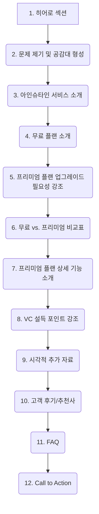

# 아인슈타인 서비스 프리미엄 플랜 페이지 설계안 (VC 설득용)

## 1. 페이지 목표

*   무료 플랜의 가치와 바이럴 가능성을 어필
*   프리미엄 플랜으로의 업그레이드 동기 명확히 제시
*   지속적인 사용 및 업셀링 유도
*   경쟁사 대비 우위 강조
*   VC에게 아인슈타인 서비스의 성장 가능성과 수익 모델의 타당성을 설득

## 2. 핵심 전략 문서 기반

*   "아인슈타인 (Einstein) 무료 vs. 프리미엄 플랜 차별화 전략 (VC 설득용)" 문서 내용을 기반으로 설계

## 3. 페이지 구조도 (Mermaid Diagram)

## 4. 섹션별 상세 내용 및 VC 어필 포인트

### 1. 히어로 섹션 (Hero Section)
*   **목표:** 서비스의 비전과 핵심 가치를 강력하게 전달하여 첫인상 각인
*   **주요 내용:**
    *   **헤드라인 예시:** "학습의 한계를 넘어, 잠재력을 폭발시키세요!", "아인슈타인 프리미엄: 당신의 학습 효율을 극대화하는 가장 스마트한 방법"
    *   **서브 헤드라인:** 서비스의 핵심 가치를 간결하게 요약 (예: AI 기반 학습 혁신 플랫폼)
    *   **시각 자료:** 서비스의 핵심 기능을 직관적으로 보여주는 고품질 이미지 또는 짧은 소개 영상 (15~30초)
    *   **CTA 버튼 (선택 사항):** "더 알아보기" 또는 "프리미엄 플랜 소개"
*   **VC 어필 포인트:**
    *   명확하고 강력한 메시지로 서비스의 정체성과 지향점을 제시
    *   높은 퀄리티의 시각 자료로 전문성과 신뢰감 부여

### 2. 문제 제기 및 공감대 형성 (The Challenge We Solve)
*   **목표:** 타겟 사용자가 겪는 학습의 어려움을 제시하여 서비스 필요성에 대한 공감대 형성
*   **주요 내용:**
    *   **소제목 예시:** "혹시 당신도 이런 어려움을 겪고 있나요?", "끝없는 학습 자료, 정리가 막막하다면?"
    *   **구체적인 문제점 나열 (Pain Points):**
        *   방대한 학습 자료 정리의 어려움 (시간 부족, 비효율)
        *   핵심 내용 파악의 어려움 (정보 과부하)
        *   단순 암기 위주의 비효율적인 학습 방식
        *   개인에게 최적화되지 않은 학습 경험
        *   시험 기간의 압박감과 불안함
    *   **공감 유도 문구:** "아인슈타인은 이러한 학습의 어려움을 깊이 이해합니다."
*   **VC 어필 포인트:**
    *   명확한 시장 문제(Pain Point)를 인지하고 있음을 어필
    *   타겟 고객의 니즈에 대한 깊은 이해도 강조

### 3. 아인슈타인 서비스 소개 (Introducing Einstein: The Smart Learning Solution)
*   **목표:** 앞서 제시된 문제에 대한 명확한 해결책으로서 아인슈타인 서비스 소개
*   **주요 내용:**
    *   **소제목 예시:** "AI가 만드는 학습의 혁신, 아인슈타인", "당신의 학습 잠재력을 깨우는 열쇠"
    *   **서비스 정의:** "아인슈타인은 AI 기술을 통해 학습 자료를 자동으로 분석, 요약, 정리하고 개인 맞춤형 학습 경험을 제공하여 학습 효율을 극대화하는 지능형 학습 지원 플랫폼입니다."
    *   **핵심 가치 (Value Proposition) 간략 소개:**
        *   시간 절약 및 학습 효율 증대
        *   심층적인 내용 이해 지원
        *   개인 맞춤형 학습 경로 제공
        *   자기주도학습 역량 강화
*   **VC 어필 포인트:**
    *   문제에 대한 구체적이고 혁신적인 솔루션 제시
    *   서비스의 핵심 경쟁력과 차별화된 가치를 명확히 전달

### 4. 무료 플랜 소개 (Experience the Core Value - Free Plan)
*   **목표:** 무료 플랜의 핵심 가치를 명확히 전달하고, 서비스 경험 및 바이럴 확산 가능성 어필
*   **주요 내용:**
    *   **소제목 예시:** "아인슈타인의 핵심 기능을 무료로 경험하세요!", "부담 없이 시작하는 스마트 학습"
    *   **무료 플랜 제공 핵심 기능 (문서 기반):**
        *   **자료 업로드 & 관리:** 월별 제한된 폴더/파일 업로드 (예: 3개 폴더, 총 500MB), 자동 Class 생성 및 기본 분류
        *   **스마트 콘텐츠 변환:** 기본 요약본 제공 (길이/난이도 조절 불가), 자동 목차 생성 (제한된 수준), 핵심 키워드 추출 (일부)
        *   **학습 확인 & 관리:** 챕터당 제한된 수의 AI 퀴즈 자동 생성 (예: 5문제, 객관식 위주), 기본 오답 확인 기능 (해설 미제공)
    *   **무료 플랜의 가치:** "무료 플랜만으로도 아인슈타인의 편리함과 AI 기반 학습 지원의 강력함을 충분히 맛볼 수 있습니다."
    *   **CTA:** "지금 바로 무료로 시작하기"
*   **VC 어필 포인트 (문서 기반):**
    *   "무료 플랜은 저희 서비스의 핵심 가치인 '자료 정리 자동화'와 'AI 기반 학습 보조'를 충분히 경험하게 설계되었습니다. 이를 통해 사용자는 즉각적인 편리함을 느끼고, SNS나 친구들에게 쉽게 공유할 수 있습니다." (Product-Led Growth, 바이럴 효과 강조)
    *   "업로드 제한과 기능 제약은 사용자가 서비스의 잠재력을 충분히 인지한 후 '더 깊이, 더 많이' 사용하고 싶다는 자연스러운 니즈를 갖도록 유도합니다. 이는 프리미엄 전환의 강력한 동기가 됩니다."

### 5. 프리미엄 플랜으로의 업그레이드 필요성 강조 (Why Go Premium? Unlock Your Full Potential!)
*   **목표:** 무료 플랜 사용자가 자연스럽게 프리미엄 플랜의 필요성을 느끼도록 유도하고, 명확한 유료화 동기 부여
*   **주요 내용:**
    *   **소제목 예시:** "학습의 다음 레벨로, 아인슈타인 프리미엄", "단순한 편리함을 넘어, 압도적인 학습 성과를 원한다면?"
    *   **무료 플랜의 '아쉬움' 자극:**
        *   "더 많은 자료를 관리하고 싶으신가요?"
        *   "더 깊이 있는 분석과 맞춤형 요약이 필요하신가요?"
        *   "다양한 유형의 문제와 상세한 해설로 완벽하게 학습하고 싶으신가요?"
    *   **프리미엄 플랜이 제공하는 핵심 가치 재강조:** 압도적인 시간 절약, 심층적인 이해, 개인 맞춤형 학습 경험, 궁극적인 성적 향상
    *   **전환 유도 메시지:** "아인슈타인 프리미엄으로 당신의 학습 잠재력을 100% 발휘하세요."
*   **VC 어필 포인트:**
    *   논리적인 흐름으로 유료 전환의 당위성 제시
    *   프리미엄 플랜의 가치를 매력적으로 포장하여 높은 전환율 기대감 형성

### 6. 무료 vs. 프리미엄 비교표 (Free vs. Premium: Choose Your Plan)
*   **목표:** 무료 플랜과 프리미엄 플랜의 기능 차이를 명확하게 시각적으로 비교하여 프리미엄 플랜의 우위 강조
*   **주요 내용:**
    *   **표 형태:** 제공된 "아인슈타인 (Einstein) 무료 vs. 프리미엄 플랜 차별화 전략" 문서의 비교표를 기반으로 디자인
    *   **비교 항목:** 자료 업로드 & 관리, 스마트 콘텐츠 변환, 학습 확인 & 관리, 부가 기능 등
    *   **강조:** 프리미엄 플랜의 '무제한', '고급', '심층', '개인 맞춤' 등의 키워드를 시각적으로 강조 (예: 아이콘, 색상 활용)
    *   **각 플랜 하단에 CTA 버튼:** "무료로 시작하기" / "프리미엄 플랜 자세히 보기" 또는 "프리미엄 플랜 구독하기"
*   **VC 어필 포인트:**
    *   프리미엄 플랜의 압도적인 기능적 우위를 한눈에 보여줌
    *   사용자가 자신의 니즈에 맞는 플랜을 쉽게 선택하도록 유도 (결국 프리미엄으로)

### 7. 프리미엄 플랜 상세 기능 소개 (Unlock Your Full Potential - Premium Features Deep Dive)
*   **목표:** 프리미엄 플랜의 핵심 기능들을 각각의 가치와 함께 상세히 설명하여 구매 설득력 극대화
*   **주요 내용 (문서 기반, 각 기능별 섹션 또는 탭으로 구성 가능):**
    *   **무제한 자료 업로드 & 고급 관리:**
        *   내용: 무제한 폴더/파일 업로드 (대용량 지원), 고급 분류 및 태깅 기능 (사용자 정의 태그, 자동 태그 추천), 버전 관리/히스토리
        *   가치: "모든 학습 자료를 아인슈타인 하나로! 용량 걱정 없이 체계적으로 관리하세요."
    *   **고품질 심층 스마트 콘텐츠 변환:**
        *   내용: 고품질 심층 요약본 (길이/난이도 상세 조절), 상세 목차 및 연관 개념 맵 생성, 핵심 키워드 및 설명 심층 제공, 강의 내용 팟캐스트 변환 (MP3 무제한 추출), 표/이미지 내 텍스트 추출 및 분석(OCR 강화), (향후) 예상 문제 유형 자동 생성
        *   가치: "단순 요약을 넘어선 깊이 있는 이해! 이동 중에도, 다양한 방식으로 학습 효율을 극대화하세요."
    *   **AI 기반 맞춤형 학습 확인 & 관리:**
        *   내용: 무제한 AI 퀴즈 생성 (다양한 유형 지원), 상세 해설 및 관련 자료 링크 제공 (오답노트 심층 관리), 학습 진도 및 취약점 분석 리포트 (개인화 대시보드), (향후) AI 기반 맞춤형 복습 스케줄링
        *   가치: "나만의 AI 학습 코치! 취약점을 정확히 파악하고, 완전 학습을 달성하세요."
    *   **프리미엄 전용 부가 기능:**
        *   내용: 광고 제거, 우선 고객 지원, LMS/Notion 등 외부 서비스 연동 (무제한), 오프라인 사용 지원 (일부 기능)
        *   가치: "오직 학습에만 집중할 수 있는 쾌적한 환경과 편리한 연동성을 경험하세요."
*   **VC 어필 포인트 (문서 기반):**
    *   "프리미엄 플랜은 단순히 제한을 푸는 것을 넘어, AI 기술을 통해 **학습의 질 자체를 혁신**합니다." (Value Proposition 강조)
    *   "오답노트 심층 관리 및 개인별 취약점 분석 기능은 **학생 스스로 학습 과정을 주도하고 개선하는 '자기주도학습 역량'을 강화**합니다." (Lock-in 효과, 교육적 임팩트 강조)

### 8. VC 설득 포인트 강조 (Why Invest in Einstein? The Future of Learning)
*   **목표:** 투자 가치를 직접적으로 어필하고, 사업의 성장 가능성에 대한 확신 전달
*   **주요 내용 (문서의 "VC 설득 포인트 (프리미엄 플랜)" 기반 + 추가 항목):**
    *   **명확한 ROI:** "프리미엄 플랜은 시간 절약은 물론 궁극적으로 학업 성취도 향상이라는 명확한 ROI로 이어집니다." (수치화된 예시 제시 가능)
    *   **강력한 Lock-in 효과:** "한 번 경험한 학생들은 쉽게 이탈하기 어려울 것입니다."
    *   **높은 유료 전환율 및 고객 유지율(Retention) 기대:** "강력한 유인책을 통해 높은 유료 전환율과 고객 유지율을 달성할 수 있다고 확신합니다."
    *   **경쟁사 대비 우위:** 핵심 기능, 기술력, 비즈니스 모델 등에서 경쟁사보다 뛰어난 점을 간결하게 요약 (별도 비교표 링크 가능)
    *   **시장 성장 잠재력:** 에듀테크 시장의 성장성과 아인슈타인 서비스의 확장 가능성 (타겟 확장, 글로벌 진출 등)
    *   **팀의 비전과 역량:** (간략하게 언급 또는 팀 소개 페이지 링크)
*   **VC 어필 포인트:**
    *   데이터와 논리를 기반으로 투자 매력도를 구체적으로 제시
    *   장기적인 성장 가능성과 수익성에 대한 비전을 공유

### 9. 시각적 추가 자료 (Visualizing Success: Data-Driven Insights)
*   **목표:** 데이터와 시각 자료를 통해 주장의 신뢰성을 높이고, 서비스의 효과를 직관적으로 전달
*   **주요 내용:**
    *   **사용자 여정 맵 (User Journey Map):**
        *   형태: 간결한 인포그래픽 또는 탭/슬라이드 형태
        *   내용: 무료 사용자가 어떤 계기로 프리미엄의 필요성을 느끼고, 어떤 과정을 거쳐 전환하며, 프리미엄 사용 후 어떤 만족을 얻는지 시나리오 기반으로 시각화
        *   VC 어필: 고객 획득 및 전환 전략의 타당성을 시각적으로 보여줌
    *   **기능 비교표 (Feature Matrix - Advanced):**
        *   형태: 상세 비교 테이블 (필요시 다운로드 가능한 PDF 또는 별도 페이지 링크)
        *   내용: 아인슈타인 무료/프리미엄 플랜과 주요 경쟁사 2~3곳의 핵심 기능을 비교. 아인슈타인의 차별점과 경쟁 우위를 명확히 부각
        *   VC 어필: 시장 내 경쟁 포지셔닝과 독보적인 강점을 객관적으로 제시
    *   **예상 ROI 계산기/시뮬레이터 (Interactive ROI Calculator/Simulator):**
        *   형태: 간단한 인터랙티브 웹 요소 또는 그래프/도표
        *   내용: 사용자가 자신의 평균 학습 시간, 학습 자료의 양 등을 입력하면, 아인슈타인 프리미엄 사용 시 예상되는 시간 절약 효과, 학습 효율 증대 효과 등을 시뮬레이션하여 보여줌. (초기에는 "평균 XX시간 절약", "학습 효율 N% 향상" 등 고정된 통계치 기반의 그래프로 제시 가능)
        *   VC 어필: 프리미엄 플랜의 가치를 정량적으로 보여주어 투자 회수 가능성에 대한 기대감 증폭
    *   **(선택) 초기 사용자 데이터/피드백 시각화:**
        *   형태: 만족도 그래프, 핵심 기능 사용 빈도 차트 등
        *   내용: 베타 테스트 또는 초기 사용자 그룹의 긍정적인 데이터나 피드백을 시각화하여 제시
        *   VC 어필: 실제 시장 반응을 통해 서비스의 잠재력을 입증
*   **배치 아이디어:** 각 자료의 성격에 맞게 페이지 내에 자연스럽게 통합하거나, 별도의 "데이터로 보는 아인슈타인" 섹션으로 구성

### 10. 고객 후기/추천사 (Trusted by Students & Educators)
*   **목표:** 실제 사용자 및 전문가의 목소리를 통해 서비스의 신뢰도와 효과 입증
*   **주요 내용:**
    *   **실제 사용자 후기 (학생):**
        *   구체적인 경험담 (예: "아인슈타인 프리미엄 덕분에 시험 기간이 훨씬 수월해졌어요!", "복잡한 전공 내용을 이해하는 데 큰 도움이 됐습니다.")
        *   가능하다면 사진, 이름(이니셜), 학교/학과 등 간략한 프로필 포함
    *   **전문가 추천사 (교수, 교육 컨설턴트 등):**
        *   서비스의 교육적 가치나 혁신성에 대한 코멘트
        *   사진, 직함, 소속 등 포함
    *   **형태:** 카드형 UI, 슬라이더, 인용구 등 다양하게 활용
*   **VC 어필 포인트:**
    *   제3자의 객관적인 평가를 통해 서비스의 신뢰성 확보
    *   실제 시장에서의 긍정적인 반응을 보여주어 투자 확신 강화

### 11. FAQ (Frequently Asked Questions)
*   **목표:** 잠재적 투자자 및 사용자의 궁금증을 선제적으로 해소하고, 투명하고 준비된 모습 어필
*   **주요 내용 (VC 및 사용자 공통 관심사):**
    *   **서비스 관련:**
        *   데이터 보안 및 개인정보보호 정책은 어떻게 되나요?
        *   어떤 종류의 학습 자료를 지원하나요? (파일 형식, 언어 등)
        *   AI 모델의 정확도나 신뢰성은 어느 정도인가요?
        *   향후 어떤 기능들이 추가될 예정인가요? (로드맵 간략 소개)
    *   **플랜 및 결제 관련:**
        *   프리미엄 플랜 구독 해지는 쉬운가요?
        *   단체 구독 할인이나 교육기관용 플랜도 있나요?
    *   **기술 및 지원 관련:**
        *   고객 지원은 어떻게 이루어지나요?
        *   오류 발생 시 대처 방안은 무엇인가요?
*   **형태:** 아코디언 UI 등으로 깔끔하게 정리
*   **VC 어필 포인트:**
    *   주요 우려 사항에 대한 명확한 답변으로 신뢰 구축
    *   사업의 디테일까지 고려하고 있음을 보여줌

### 12. Call to Action (CTA - Take the Next Step)
*   **목표:** 명확하고 강력한 행동 유도를 통해 다음 단계로의 전환 극대화
*   **주요 내용:**
    *   **주요 CTA 버튼 (눈에 잘 띄는 디자인):**
        *   "지금 바로 프리미엄 플랜으로 학습 혁신을 경험하세요!" (구독 페이지로 연결)
        *   "프리미엄 플랜 30일 무료 체험 신청하기" (별도 체험 프로그램 운영 시)
        *   "투자 문의 및 데모 요청하기" (VC 대상 명확한 CTA, 별도 문의 양식 또는 연락처 안내)
    *   **보조 CTA (선택 사항):**
        *   "더 자세한 기능 살펴보기" (기능 상세 페이지로 연결)
        *   "아인슈타인 팀에게 문의하기" (일반 문의)
    *   **긴급성 또는 한정성 부여 (선택 사항):** "선착순 OOO명 특별 할인", "이번 달까지 무료 체험 신청 가능" 등 (신중하게 사용)
*   **VC 어필 포인트:**
    *   명확한 다음 행동 지침을 제공하여 투자 결정 또는 추가 정보 요청을 용이하게 함
    *   적극적인 사업 추진 의지를 보여줌

## 5. 추가 고려 사항

*   **반응형 디자인:** 모든 디바이스에서 최적화된 경험 제공
*   **페이지 로딩 속도:** 사용자 이탈 방지를 위한 빠른 로딩 속도 확보
*   **일관된 브랜딩:** 서비스의 전체적인 톤앤매너와 일관성 유지
*   **A/B 테스트:** 주요 섹션의 문구, 이미지, CTA 버튼 등을 A/B 테스트하여 전환율 최적화 (향후)

이 설계안이 VC 설득을 위한 강력한 프리미엄 플랜 페이지 구축에 도움이 되기를 바랍니다.